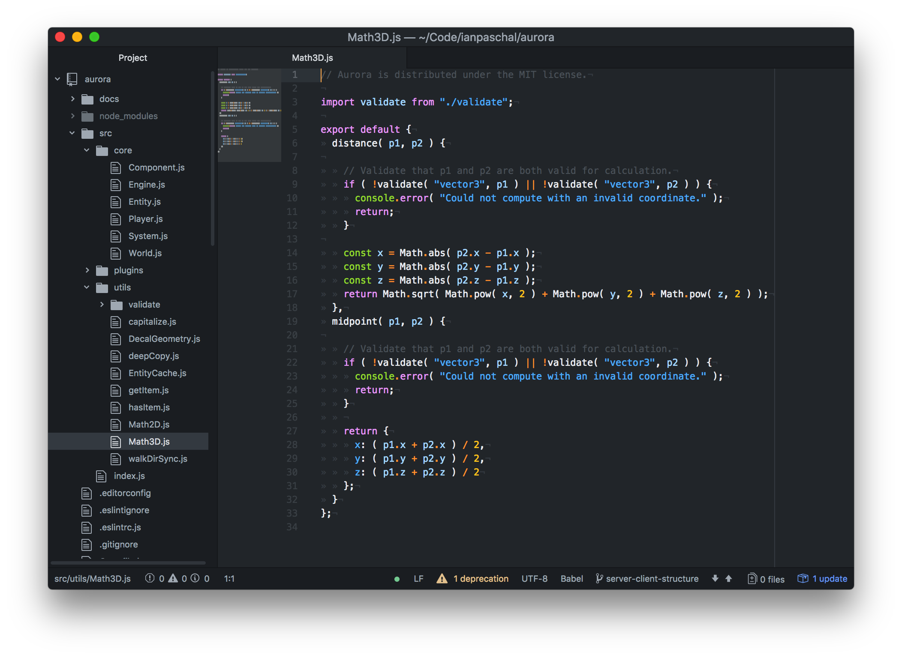

# Glimmer Dark Syntax
An Atom syntax theme with a dark background and glimmering colors.

Think it could look even sexier? Pull requests are very welcome!


*Pictured: Glimmer Dark Syntax with Atom's One Dark theme.*

## Install
Install the Glimmer Dark Syntax theme via Atom by going to Preferences/Settings → Install and search for "glimmer-dark-syntax" (make sure you're searching under "Themes"), or install through the command line:
```
apm install glimmer-dark-syntax
```

## Feedback/Issues
Found a problem with the theme?  [Report it here!](https://github.com/ianpaschal/glimmer-dark-syntax/issue) If you've got a suggestion, that's also the place for it, but better yet would be a pull request.

## License
Glimmer Dark Syntax is distributed under the **MIT License**. For details see [`LICENSE.md`](https://github.com/ianpaschal/glimmer-dark-syntax/blob/master/LICENSE)

## Donate
If you really, really like Glimmer Dark Syntax and would like to buy me a Red Bull, I can't say "no" to that. They're €1.25 at my local supermarket. [Here's my PayPal.](paypal.me/ianpaschal)
